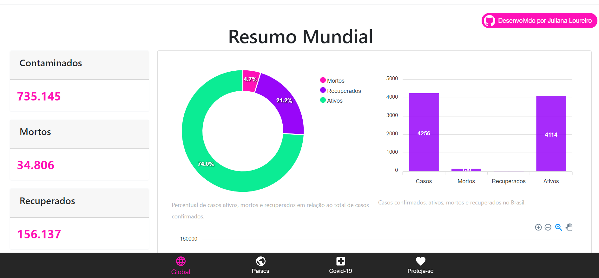

# AppCovid19

Com essa rápida proliferação do vírus e esses dias de quaretena, como Dev, resolvi tentar contribuir de alguma forma.
Crieu um dashboard que consome dados abertos sobre o Covid-19.

<b>Como usar:</b>
Dentro da pasta AppCovid19 rode o comando yarn i para que as dependências sejam instaladas.
Em seguida, rode o comando yarn start.

